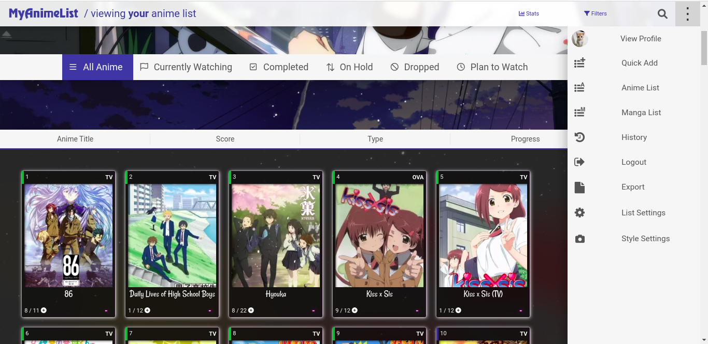
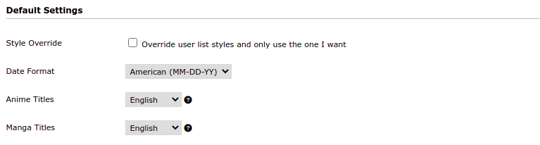
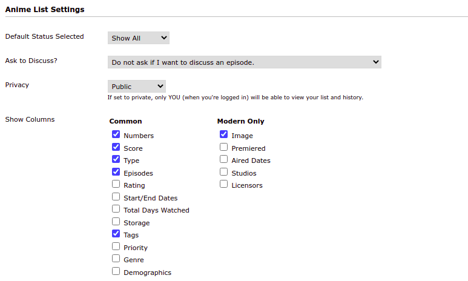
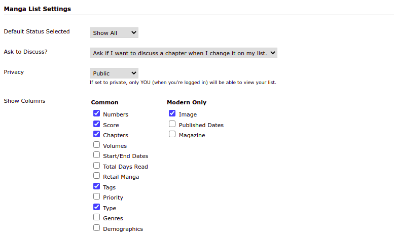
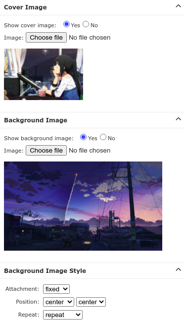

# MyAnimeList-theme
Premade CSS layout for customizing the theme of your anime list at [MyAnimeList.net](https://myanimelist.net)

## Preview
Check out this theme [here.](https://myanimelist.net/animelist/cweeper)




## Installation

For detailed guide on how to customize your anime list and premade layouts check [this.](https://myanimelist.net/forum/?topicid=1499058#msg45516528)
- Copy and paste the content of [theme.css](https://github.com/RudrakshKashyap/MyAnimeList-theme/blob/main/theme.css) file in **Add Custom CSS** section of your selected theme on [List Style Design](https://myanimelist.net/ownlist/style)
- **NOTE** *: DON'T FORGET TO CHANGE cweeper to YOUR username IN THE FIRST TWO LINES OF THE CODE*

```
@\import "https://malscraper.azurewebsites.net/covers/anime/cweeper/presets/dataimagelinkbefore";
@\import "https://malscraper.azurewebsites.net/covers/manga/cweeper/presets/dataimagelinkbefore";
```

## List settings




## Cover Image


## Background Image


## Background Image Style

